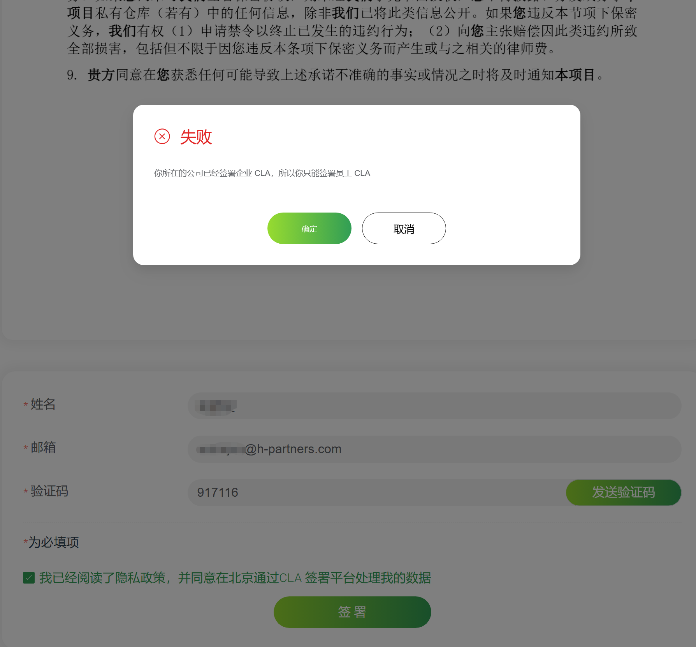
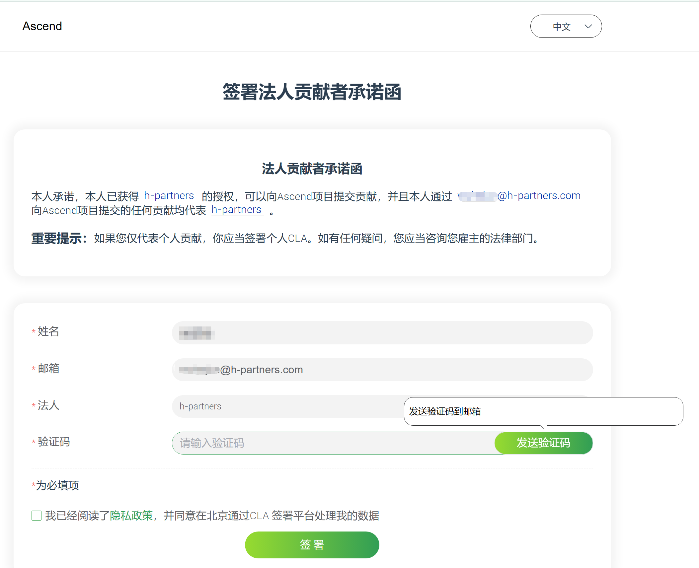
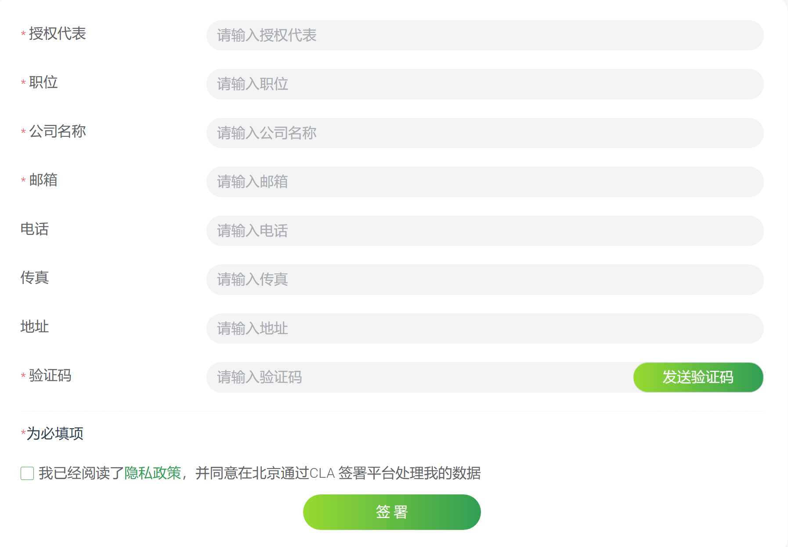
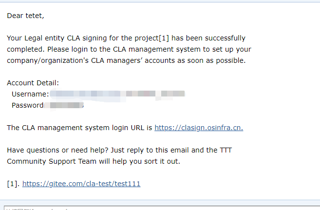
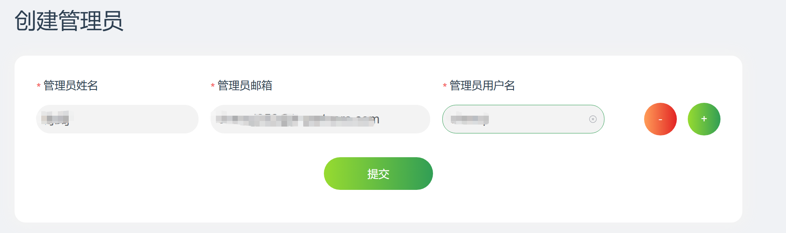
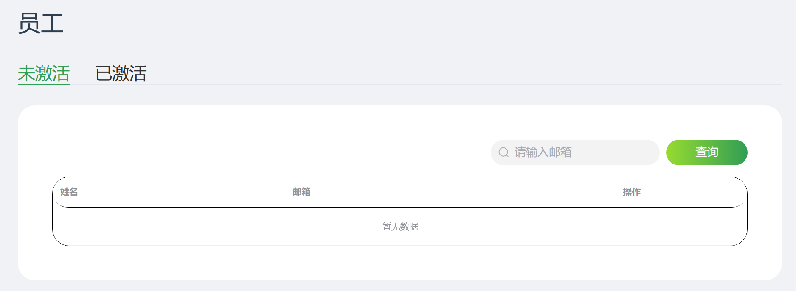
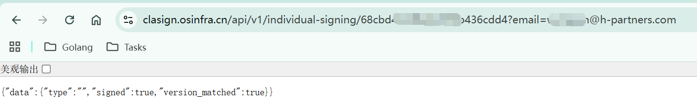
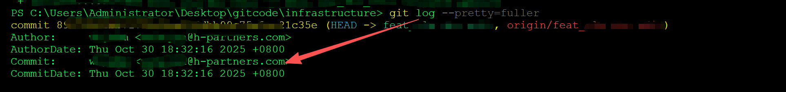

# CLA 签署指南

根据你的身份，选择对应的操作流程，这是最快完成签署的方法。


---

## 🤔 我是个人开发者，为自己做贡献


**这是最快捷的路径，无需等待，立即生效。**

### 操作步骤：

1.  **选择「签署个人CLA」**
2.  **输入你的邮箱**
    - ✅ **推荐使用个人邮箱**（例如 Gmail、Outlook、QQ 邮箱等）
    - ⚠️ **关于企业邮箱的重要说明**：
        - 如果你的公司**尚未**签署企业 CLA，你可以使用公司邮箱进行个人签署
        - 但如果你的公司**后续签署**了企业 CLA，你之前用公司邮箱签署的个人 CLA **将自动失效**
        - 为避免后续麻烦，强烈建议直接使用个人邮箱

3.  **查收邮件验证码**并回到页面填写、提交
4.  **完成！** 系统会立即提示你签署成功

### 邮箱选择建议：

| 邮箱类型 | 推荐程度 | 说明 |
|---------|----------|------|
| 个人邮箱 | ⭐⭐⭐⭐⭐ | 最安全，无后续冲突风险 |
| 公司邮箱（公司未签CLA） | ⭐⭐ | 临时可用，但有未来失效风险 |
| 公司邮箱（公司已签CLA） | ❌ 不可用 | 必须走企业员工流程 |

**最佳实践**：无论公司当前是否签署 CLA，都建议使用个人邮箱进行个人贡献者签署，一劳永逸。

### 重要提示：

如果你使用了公司邮箱，并且该邮箱域名对应的公司已经签署了企业 CLA，系统将自动识别并推荐你进行下面的"企业员工"流程，你将无法完成个人签署。



---

## 🏢 我是企业员工，代表公司做贡献


**注意：如果您是学校师生，请根据您的贡献身份选择对应流程：**
- 代表学校贡献：请参照此企业员工流程，使用学校邮箱签署
- 个人独立贡献：请选择"我是个人开发者，为自己做贡献"流程，使用个人邮箱签署

**此流程需要公司管理员审批，请耐心跟进。**

### 操作步骤：

1.  **使用公司邮箱提交申请**
    - 请务必使用你的公司邮箱（如 `your-name@your-company.com`）进行签署
    - 系统会自动识别你的企业身份

2.  **查收邮件并联系管理员（关键步骤！）**
    - 提交申请后，请务必**查收系统发送的确认邮件**
    - 这封邮件会明确告诉你：**贵公司的 CLA 管理员是谁**（通常是你的部门负责人或研发接口人）
    - 此时，你的申请状态为 **「待审批」**

3.  **等待管理员审批**
    - **请立即根据邮件提供的信息，主动联系你的 CLA 管理员**
    - 请他登录系统，在管理后台**批准你的申请**
    - **只有在他审批通过后，你的签署才会正式生效**



---

## 🏛️ 我是企业代表，需要为公司签署 CLA

 

**注意：学校代表请参照此流程，为学校签署 CLA**

**此流程最为复杂，需要您代表公司完成。**

### 操作步骤：

1.  **准备材料并提交审核**
    - 企业签署人在签署页面点击 签署法人 CLA 按钮进入到签署页面填写签署表单（签署邮箱不可更改，请用相对稳定的邮箱来签署企业CLA）
    - 公司邮箱会收到一封带有 PDF 附件的邮件，PDF 的内容包含了之前签署的 CLA 内容，请打印 PDF 文件并加盖公司公章。
    - 将加盖公章以及签好名字和日期的 CLA 协议文件扫描为 PDF 文件，作为附件回复之前收到的邮件完成企业签署 CLA 。



2.  **成为超级管理员**
    - Ascend 社区的**社区管理员**收到邮件后，会对 PDF 进行核对检查。
    - 检查通过后签署企业 CLA 使用的邮箱会收到一封确认签署成功的邮件，其中包含了**超级管理员**帐号的用户名及初始密码



3.  **设置公司的审批人员（至关重要！超级管理员和普通管理员不能是同一个账号）**
    - 超级管理员在签署页面点击 企业管理员 按钮进入到超级管理员登录页面，使用之前获得的**超级管理员**帐号的用户名及初始密码进行登录（记得更新密码）
    - 作为超级管理员，您的首要任务是：**立即为公司创建几位「普通管理员」**（例如各研发团队的负责人），将 **审批员工申请** 的日常工作分配给他们，以确保公司内部的 CLA 流程顺畅
    - 普通管理员也会收到一封包含了**普通管理员**帐号的用户名及初始密码的邮件，其登录流程与超级管理员一致，
    - 之后，你就可以让你的员工进行法人贡献者登记了，然后让普通管理员进行审批了。

4. **点击企业管理员，使用超级管理员或者普通管理员账号进行登录**


- **超级管理员登录后页面**



- **普通管理员登陆后页面**



### 管理员职责：

- **超级管理员**：负责管理普通管理员，不直接审批员工
- **普通管理员**：负责日常审批本公司员工的 CLA 签署申请
---

## ✅ CLA 签署状态验证（个人以及企业员工）

签署完成后，可以通过以下链接进行验证（将 `:community-link-id` 和邮箱替换为你签署 CLA 时的实际信息）：

https://clasign.osinfra.cn/api/v1/individual-signing/:community-link-id?email=your-email@example.com


**成功标志**：返回结果中必须包含两个 `true` 值



如果返回结果不符合上述要求，表示签署失败。

---

## ⚠️ 重要注意事项

即使 CLA 签署成功，也**不是立即**就可以向社区贡献代码。在提交 PR 时，社区机器人会检查贡献者的 CLA 状态。

### 检查机制

- 机器人通过**提交代码时的 Commit 邮箱**来验证 CLA 状态
- 如果 Git 配置的邮箱与签署 CLA 时使用的邮箱不一致，检查会失败
- 错误提示示例：`ascend-cla/no`

## 🔧 Git 邮箱配置

### 基本原则

**签署 CLA 时使用什么邮箱，提交代码时也必须使用相同的邮箱**

### 1. 提交前检查与配置

在提交代码前，建议先检查并正确配置 Git 邮箱：

#### 检查当前 Git 配置

Git 配置有三个级别（按优先级从高到低）：
- **本地配置** (`--local`)：仅对当前仓库有效
- **全局配置** (`--global`)：对当前用户的所有仓库有效  
- **系统配置** (`--system`)：对所有用户有效

建议按以下顺序检查配置：

```bash
# 检查当前仓库的本地配置（优先级最高）
git config user.name
git config user.email

# 检查全局配置
git config --global user.name
git config --global user.email

# 检查系统配置
git config --system user.name
git config --system user.email
```

#### 检查结果说明：

  - 如果命令有输出，显示当前配置的用户名和邮箱

  - 如果命令没有输出，表示该级别未设置对应配置

  - Git 会按优先级使用第一个找到的配置

#### 配置 Git 邮箱信息

根据你的需求选择合适的配置级别：

```bash
# 配置当前仓库的本地信息（推荐用于公司项目）
git config user.name "你的姓名"
git config user.email "签署CLA的邮箱"

# 配置全局信息（推荐用于个人项目）
git config --global user.name "你的姓名"
git config --global user.email "签署CLA的邮箱"
```

#### 配置建议

  - 如果你主要在个人项目贡献，使用 --global 配置

  - 如果你在公司项目贡献，建议在项目目录中使用 --local 配置

  - 使用 git config --list --show-origin 验证配置是否生效


## FAQ

#### 1. **提交PR后出现ascend-cla/no红色标签处理指南**

##### 问题描述
出现`ascend-cla/no`标签表示PR中的部分commit作者没有签署Ascend社区的贡献者协议CLA。

##### 处理流程

第一步：确认CLA签署状态

访问PR评论区提供的CLA签署地址，确认签署状态：

- **个人贡献者**：选择"签署个人CLA"
- **企业贡献者**：
  - 已签署企业CLA的员工：选择"法人贡献者登记"

第二步：根据签署状态处理

##### 情况A：尚未签署CLA
1. 完成CLA签署
2. 在PR评论区评论`/check-cla`
3. 系统自动更新标签为`ascend-cla/yes`

> 注：企业CLA需要管理员审批

##### 情况B：已签署CLA

**1. 检查commit邮箱**
```bash
git log --pretty=fuller
```


**2. 根据检查结果处理**

子情况B1：commit邮箱与CLA邮箱不一致

| 场景 | 选择方案 | 操作步骤 |
|------|----------|----------|
| commit邮箱与Gitcode提交邮箱一致 | 使用该邮箱重新签署 | 用commit邮箱重新签署CLA |
| 希望使用commit邮箱签署 | 调整Gitcode设置 | 在Gitcode设置中添加commit邮箱并设为提交邮箱 |
| 希望使用Gitcode提交邮箱签署 | 调整本地git配置 | 使用`git config --global user.email "邮箱"`修改配置 |

**修正commit邮箱命令：**

```bash
# 修正最后一次提交
git -c user.name="正确姓名" -c user.email="正确邮箱" commit --amend --reset-author

git commit --amend --author="正确姓名 <正确邮箱>" --no-edit

# 强制推送
git push --force

# 修正多个提交
# 1. 交互式rebase
git rebase -i <commit_id>~n

# 2. 将pick改为edit，逐一执行：
git commit --amend --author="正确姓名 <正确邮箱>" --no-edit
git rebase --continue

# 3. 强制推送
git push --force
```

子情况B2：commit邮箱与CLA邮箱一致

- 在当前仓库提交issue

- 提供PR链接和CLA邮箱信息

- 等待社区维护人员处理

**注意事项**

- CLA检查以commit信息中的committer邮箱为准

- 修改commit历史需要强制推送权限

- 如有疑问，请在PR评论区留言或提交issue

#### 2. 企业邮箱登记时，提示"没有这个公司的信息"

| 请参阅本文档[cla使用指南](../cla/cla使用指南.md)中的「🏢 我是企业员工，代表公司做贡献」章节。

| 错误场景 | 优化后的错误提示 | 说明与指导 |
|---------|------------------|-----------|
| **公司未注册** | **❌ 公司未签署协议**<br>贵公司（域名：`@your-company.com`）尚未在系统中完成企业CLA签署。 | **1. 联系公司：** 请将此事告知您的部门负责人或法务团队，请他们以**企业代表**身份完成公司签署。<br>**2. 临时方案：** 若想立即贡献，可先使用**个人邮箱**以**个人开发者**身份签署。 |
| **公司已注册，但用户邮箱域名不匹配** | **❌ 邮箱域名与已签署公司不匹配**<br>您使用的邮箱（`@other-company.com`）与已签署CLA的公司域名（`@your-company.com`）不符。 | **解决方案：** 请切换至您公司的企业邮箱账户进行操作，或使用该邮箱对应的账户登录。 |

#### 3. 同一域名/邮箱是否可签署多次

| 请参阅本文档[cla使用指南](../cla/cla使用指南.md)中的「🏛️ 我是企业代表，需要为公司签署 CLA」章节。

| 错误场景 | 优化后的错误提示 | 说明与指导 |
|---------|------------------|-----------|
| **重复签署企业CLA** | **❌ 企业协议已存在**<br>贵公司（域名：`@your-company.com`）已完成企业CLA签署，无需重复操作。 | **下一步：** 如果您是公司新员工，请进行【**企业员工登记**】。如果您是管理员，请直接【**登录管理后台**】。 |

#### 4. 企业员工使用个人邮箱登记

| 请参阅本文档[cla使用指南](../cla/cla使用指南.md)中的「🤔 我是个人开发者，为自己做贡献 或者 🏢 我是企业员工，代表公司做贡献」章节。

| 错误场景 | 优化后的错误提示 | 说明与指导 |
|---------|------------------|-----------|
| **企业员工使用个人邮箱选择"企业签署"** | **❌ 身份路径选择错误**<br>检测到您使用个人邮箱，但选择了企业签署路径。 | **请选择：**<br>• **方案A（推荐）：** 改用您的**企业邮箱**，以完成企业员工登记。<br>• **方案B：** 继续使用当前邮箱，但身份将切换为**个人贡献者**，您的贡献将不代表公司。 |
| **企业员工使用个人邮箱选择"企业员工登记"** | **❌ 无效的邮箱类型**<br>企业员工登记必须使用公司邮箱。您当前使用的（`@gmail.com`）是个人邮箱。 | **解决方案：** 请更换为您的公司邮箱账户进行操作。如果您没有公司邮箱，请联系贵司IT部门或CLA管理员。 |

#### 5. 问：收不到来自社区发来的签署cla的邮件或找不到管理员怎么办？
**答： 首先检查邮箱的垃圾邮件文件夹。如果仍无法找到，请在公司的技术交流群或直接向你的上级询问："我们公司开源 CLA 的审批负责人是谁？"**