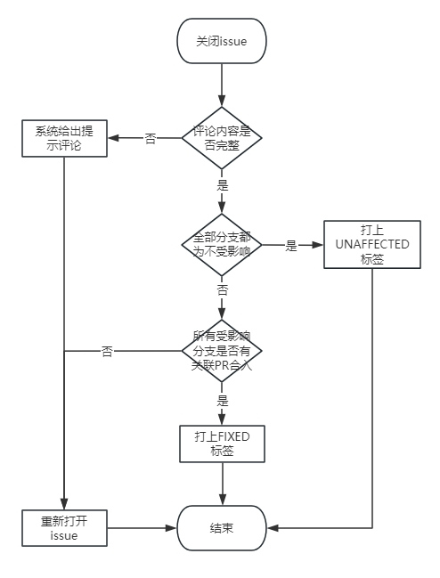

# cve-manager（漏洞管理）使用说明

## 概述
此文档帮助开发者了解漏洞管理工具的大致工作流程，利用工具顺利完成漏洞issue的闭环。

## 漏洞issue
漏洞管理工具发现当前仓库的依赖包存在漏洞时，会直接在仓库下创建issue，方便开发者跟踪、修复。

### issue标题
漏洞issue采用漏洞的编号作为issue的标题，漏洞编号的格式为CVE-年份-xxxxx。如CVE-2024-2961、CVE-2025-13097。

### issue内容
工具创建的issue采用固定模板，主要有两部分内容：
- 漏洞信息，包含了漏洞的编号、影响组件、描述等信息
- 漏洞分析结构反馈，所有条目开始均为空值，需要开发者根据当前的情况自行填写，填写方式下文介绍


## 如何关闭issue
关闭issue前必须进行分析评论，让工具知道该漏洞的影响情况。分析后的issue关闭分为两种情况：
- 所有分支都是不受影响，可直接关闭
- 存在受影响的分支，该issue必须关联目标分支为受影响分支的PR，且PR为已合入的状态

### issue分析评论流程
评论模板如下，该模板会在issue创建后通过评论给出。
```batch
影响性分析说明: 

漏洞评分(ascend评分):
BaseScore: x.x(浮点格式)
Vector:

受影响版本排查(受影响/不受影响): 
master:
```

- 影响性分析说明，填写漏洞的描述，如何影响当前组件/系统，可以与工具给出的描述一致或稍加补充。
- 漏洞评分，一般与系统给出的评分和向量保持一致，如果有不同的地方可自行分析得出评分和向量。有时系统尚未收集到评分数据，开发者可直接评论从其他途径得到的数据。
  有评论零值的要求时，BaseScore填写0.0，Vector填写N/A。
- 受影响版本排查，版本名通常对应仓库分支，需要排查对应分支是否受该漏洞影响，填写内容为**受影响**、**不受影响**。
  分支名和数量找管理员配置。

完整的评论内容举例：
```batch
影响性分析说明: 
该漏洞影响组件为apachekafkaclient，触发条件与apachedruid有关。
经排查，当前社区使用的均为alibabadruid，而未apachedruid，故不受影响。

漏洞评分(ascend评分):
BaseScore: 7.5
Vector: CVSS:3.1/AV:N/AC:L/PR:N/UI:N/S:U/C:H/I:N/A:N

受影响版本排查(受影响/不受影响): 
1.master:不受影响
```

- 任何开发者都可以对issue进行评论分析
- 分析内容必须一次性填写完整，填写错误工具会给出提示
- 重复分析会覆盖上一次分析的内容
- 分析通过后工具会以表格的方式在评论区回显分析的内容（表格形式如下），并同步修改issue的描述

  | 状态  | 分析项目      | 内容                      |
    |-----|-----------|-------------------------|
  | 已分析 | 影响性分析说明   | 该漏洞影响组件为apachekafkaclient，触发条件与apachedruid有关。经排查，当前社区使用的均为alibabadruid，而未apachedruid，故不受影响。                 |
  | 已分析 | BaseScore | 7.5                     |
  | 已分析 | Vector    | CVSS:3.1/AV:N/AC:L/PR:N/UI:N/S:U/C:H/I:N/A:N   |
  | 已分析 | 受影响的版本排查  | master:不受影响 |

## 关闭issue的条件
进行分析评论的目的是对关闭issue的过程进行监督和约束，未分析或未成功分析的issue无法被关闭。
关闭issue的流程如下图所示：



- 关闭issue需手动触发，工具负责后续检查
- 受影响分支可能有一个或多个，多个分支需要分别关联多个PR
- 尽量先进行分析评论，再关联PR

## 误报
漏洞匹配过程中可能存在误报，这种issue可直接拒绝。但由于gitcode没有拒绝功能，可走不受影响的流程。