****
##  🚀 Ascend社区Bot用户交互流程

Ascend社区中所有项目均由Bot维护，这意味着开发人员可以在每个Pull Request或者Issue下面可以通过评论触发Bot命令， 主要交互流程图如下：

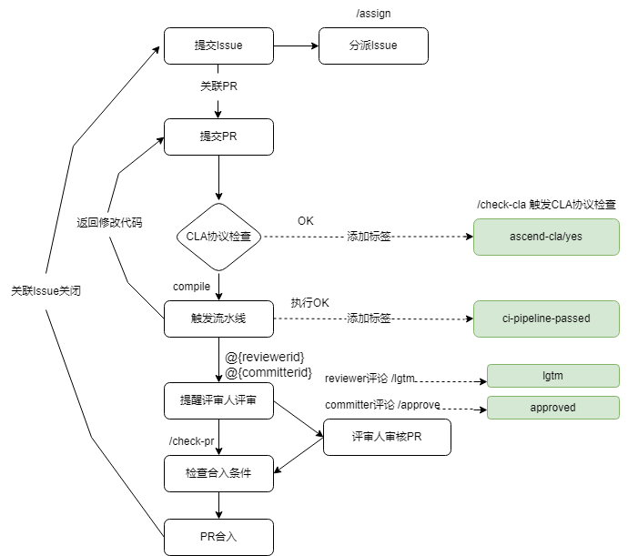

## 🎯 如需了解详细的命令，可参考下方详细表格

| 命令 | 示例 | 使用范围 | 描述 | 面向对象 | 使用仓库 |
|--|--|--|--|--|--|
| /check-cla | 	/check-cla | Pull Request | 强制重新检查Pull Request的CLA状态。如果Pull Request的提交者已经签署了CLA协议，则ascend-cla/yes标签将会被添加到Pull Request中；如果没有，则标签ascend-cla/no将被添加到Pull Request中。 | 所有开发者 | 所有仓库 |
| /cla cancel |  cancel	/cla cancel | Pull Request | 强制删除ascend-cla/yes标签。 | 仓库管理员 | 所有仓库 |
| compile | compile | Pull Request | 触发编译CodeArts流水线。编译通过后，该Pull Request会被打上ci-pipeline-passed的标签。若编译失败，该Pull Request会被打上ci-pipeline-failed的标签。 | 所有开发者 | 所有仓库(MindSeriesSDK和MindCluster所属仓库除外) |
| rebuild | rebuild | Pull Request | 触发编译CodeArts流水线。编译通过后，该Pull Request会被打上ci-pipeline-passed的标签。若编译失败，该Pull Request会被打上ci-pipeline-failed的标签。 | 所有开发者 | MindSeriesSDK和MindCluster所属仓库 |
| system-test | system-test | Pull Request | 触发前冒烟。前冒烟通过后，该Pull Request会被打上st-success的标签。若前冒烟失败，该Pull Request会被打上st-fail的标签。 | 所有开发者 | MindIE-SD仓库 |
| get-log | get-log | Pull Request | 获取通过compile触发的CodeArts流水线构建任务状态。所有构建任务通过后，该Pull Request会被打上ci-pipeline-passed的标签。若构建失败，该Pull Request会被打上ci-pipeline-failed的标签，可查看相关构建日志。 | 所有开发者 | PTA相关仓库 |
| retry	 | retry | Pull Request | 重试CodeArts流水线。 若编译失败，该Pull Request会被打上ci-pipeline-failed的标签，在不修改代码的情况下，从流水线失败的地方重新触发。 | 所有开发者 | PTA相关仓库 |
| stop	 | stop | Pull Request | 停止已经触发的CodeArts流水线，该Pull Request会被打上ci-pipeline-failed的标签。 | 所有开发者 | PTA相关仓库 |
| /lgtm | /lgtm | Pull Request | 添加用于代表代码已经评审过的标签 lgtm。 | 仓库所属sig组的reviewers | 所有仓库 |
| /lgtm cancel | /lgtm cancel | Pull Request | 移除用于代表代码已经评审过的标签 lgtm。 | 仓库所属sig组的reviewers | 所有仓库 |
| /approve | /approve | Pull Request | 添加用于代表committers同意合并的标签 approved, 默认采取squash合并方式来合并PR。 | 仓库所属sig组的committers | 所有仓库 |
| /approve cancel | /approve cancel | Pull Request | 移除用于代表committers同意合并的标签 approved。 | 仓库所属sig组的committers | 所有仓库 |
| /check-pr | /check-pr | Pull Request | 检查Pull Request中的标签是否满足条件，如果满足条件，则合并Pull Request。 | 任何人都可以在Pull Request上触发此命令 | 所有仓库 |
| /merge | /merge | Pull Request | 添加用于代表branch_keeper同意合并的标签 keeper_approved。 | 仓库对应分支的branch_keeper | 所有仓库 |
| /kind ** | /kind bug, **可接受大小写字母、数字、中划线、下划线，对于下面的规则通用** | Pull Request   Issue | 添加标签 kind/bug。 | 仓库管理员可以直接添加；其他人可以使用评论添加标签，如kind/AI，前提是仓库中必须存在此标签，否则添加不上 | 所有仓库 |
| /remove-kind ** | /remove-kind bug | Pull Request   Issue | 移除标签 kind/bug。 | 所有人 | 所有仓库 |
| /priority ** | /priority high | Pull Request   Issue | 添加标签 priority/high。 | 仓库管理员可以直接添加；其他人可以使用评论添加标签，如kind/AI，前提是仓库中必须存在此标签，否则添加不上 | 所有仓库 |
| /remove-priority ** | /remove-priority high | Pull Request   Issue | 移除标签 priority/high。 | 所有人 | 所有仓库 |
| /sig ** | /sig AI | Pull Request   Issue | 添加标签 sig/AI。 | 仓库管理员可以直接添加；其他人可以使用评论添加标签，如kind/AI，前提是仓库中必须存在此标签，否则添加不上 | 所有仓库 |
| /remove-sig ** | /remove-sig AI | Pull Request   Issue | 移除标签 sig/AI。 | 所有人 | 所有仓库 |
| /assign [[@]...] | /assign   /assign @ascend-robot | Issue | 为Issue指派一位负责人。 | 所有人 | 所有仓库 |
| /unassign [[@]...] | /unassign   /unassign @ascend-robot | Issue | 取消Issue指派的负责人。 | 所有人 | 所有仓库 |

## 🔍 FAQ

#### 1. **请问签署cla协议遇到问题，需要怎么处理？**

请参考[cla使用指南](../cla/cla使用指南.md)

#### 2.  **请问PR评论/lgtm和/approve后，没有自动打上lgtm和approved标签，需要怎么处理？**
1. 首先请查看确认评论/lgtm和approve的人是否是对应模块的reviewer和committer，完整的reviewer和committer名单可以在PR的第一条评论点击对应的链接查看，如下图所示：
    
    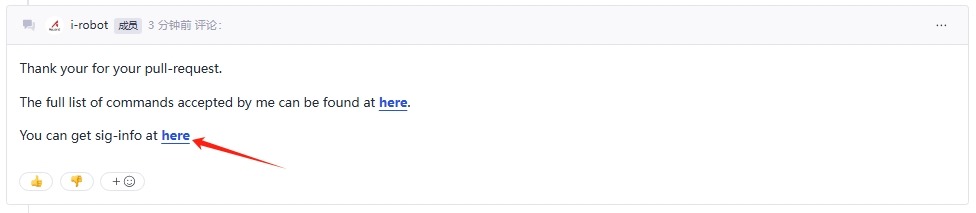

    **注意：** 需要仔细对比评论人的gitcode-id 和 sig-info.yaml里填写的gitcode-id，并且id区分大小写；若id不一致，会导致无法打上对应的标签，请提PR修改sig-info.yaml里对应的id，PR合入10min后权限生效，权限生效后，重新给PR评论/lgtm和/approve即可

2. 然后检查评论各模块/lgtm和/approve数量是否足够，一般情况下PR涉及的每个模块都需要1个reviewer评论/lgtm和1个committer评论/approve才能打上lgtm标签和approved标签；

3. 对比检查评论/lgtm和/approve的时间和PR最新的一个commit的时间，如果评论时间早于commit的时间，则评论无效，如下图所示：

    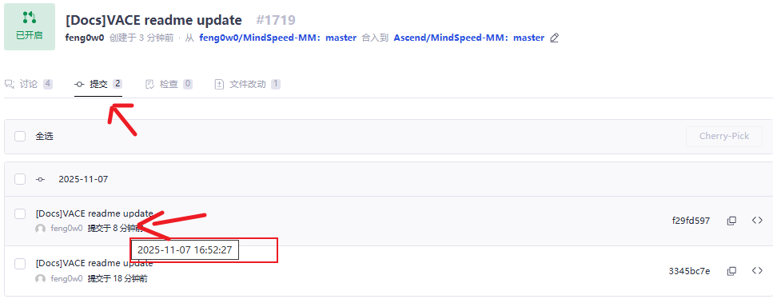

    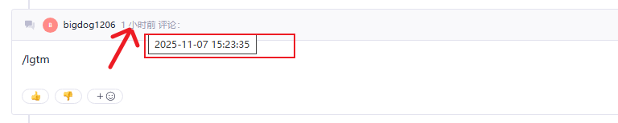

    **问题原因:** 造成这个现象出现，一般是开发者提交代码使用的机器设置的时间与实际时间不一致导致的

    **推荐解决办法:** 重新设置机器的时间与实际时间保持一致，然后本地代码仓回退至上一个commit，重新提交代码并push

4. 如果以上情况都检查过确认没有问题，但还是没有打上对应的lgtm和approved标签，可能是网络波动导致的，请耐心等待1min然后重新评论/lgtm或者/approve触发打标签即可(除了PR作者和机器人，任意一人评论都可以)。

#### 3.  **请问PR具备足够标签后并没有自动合入，需要怎么处理？**

PR具备足够标签后并没有自动合入，机器人会评论相应的提示信息，主要分为以下几种情况:
1. 评论提示信息是"Do not meet the condition of Fast-forward Merge, please do the rebase."

    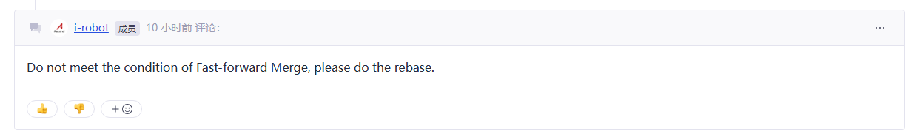
    
    **问题原因:** 仓库PR设置的合并模式是只有满足 fast - forward 条件（指 pull request 中的 commits 都是基于目标分支最新的 commit 提交点进行提交的）下才能执行合并操作，否则会提示开发人员进行 rebase 操作。
    
    **推荐解决办法有如下两个（二选一）：**
    - PR的作者基于目标分支最新的commit rebase代码；
    - 或者联系仓库管理员修改仓库设置里的PR合并模式，如下图所示：

    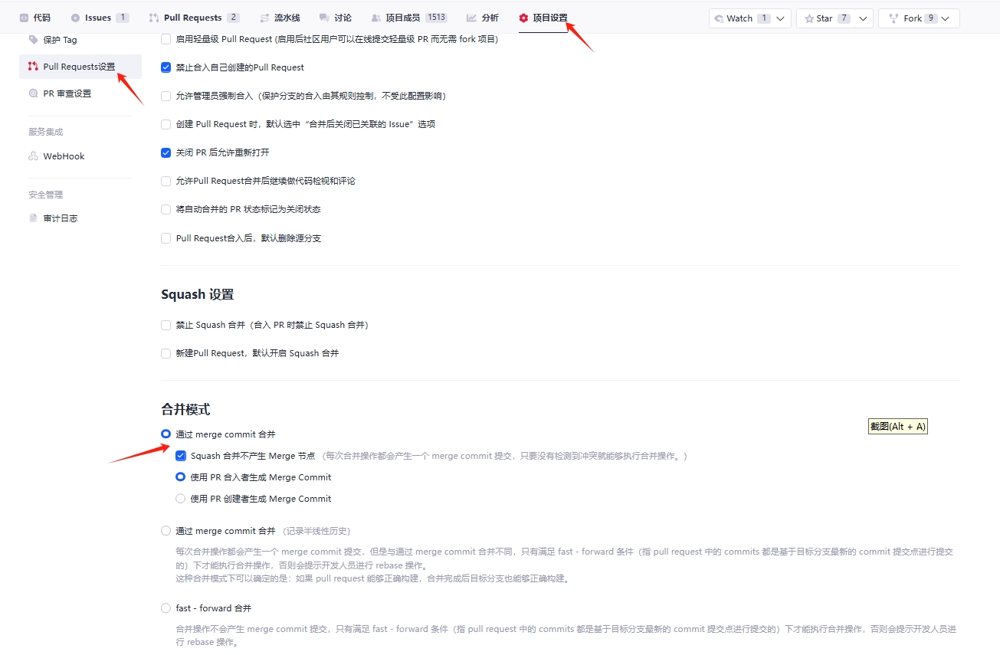

    **规避措施:** 仓库管理员在创建仓库时，参考上图所示设置好PR合并模式。

2. 评论提示信息是"You do not have permissions to push into target branch"

    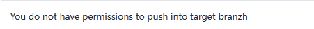
    
    **问题原因:** 机器人账号没有合入该分支PR的权限。
    
    **推荐解决办法如下：**
    联系仓库的管理员修改仓库设置，授予机器人账号合入对应分支PR的权限，如下图所示：

    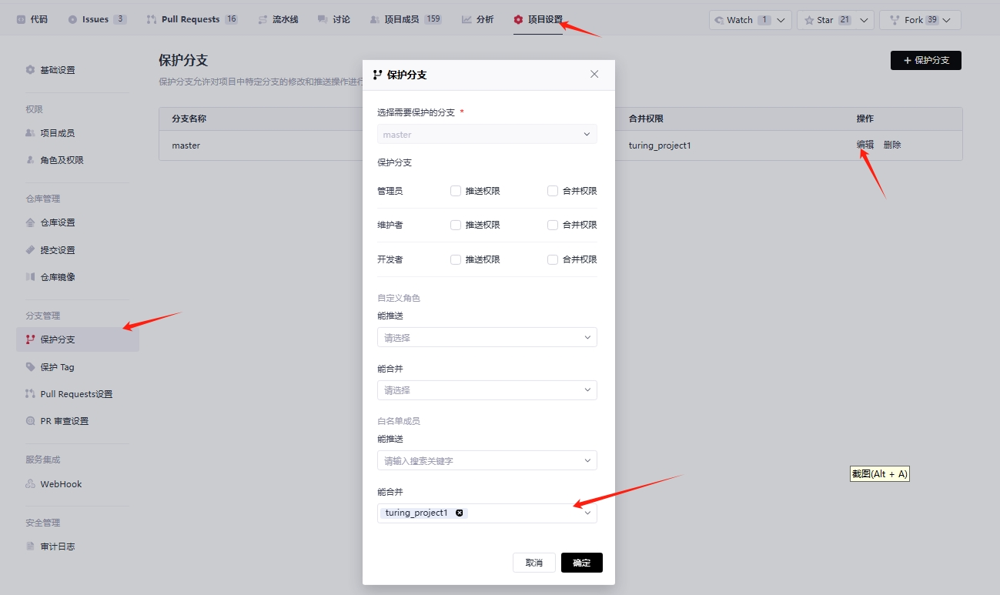

    **规避措施:** 仓库管理员在创建仓库时，参考上图所示授予机器人账号合入对应分支PR的权限。

3. 评论提示信息是"Failed to squash. You can try the following methods to solve the problem..."

    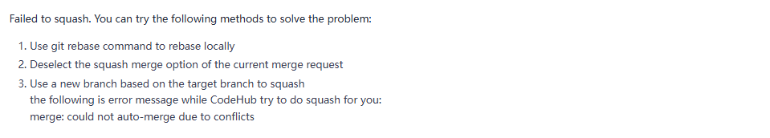

    **问题原因:** PR的代码和目标分支的最新代码存在冲突。
    
    **推荐解决办法如下**：
    请开发者参考评论提示解决冲突后重新push代码。
    
    **规避措施:** 开发者在提交代码前先pull主仓的最新代码，在本地代码仓确认没有代码冲突后再提交代码。

4. 评论提示信息是"Something went wrong during merge: git update-ref: exit status 128..."
    
    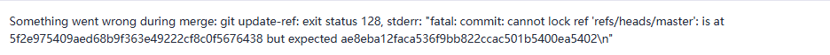
    
    **问题原因:** 同一时间、同一个仓库、同一个分支另外一笔PR正在合入，产生的并发问题。
    
    **推荐解决办法如下：**
    请开发者耐心等待1min左右，再次评论/check-pr触发PR合入，可以解决此问题。

5. 评论提示信息是"The MR can not be merged, because of this MR is work in process."
    
    **问题原因:** PR标题以[WIP]开头，PR无法被合入。
    
    **推荐解决办法如下：**
    删除PR标题上的[WIP]，如下图所示：
    
    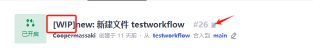

    **规避措施:** PR标题不要以[WIP]开头。

6. 评论提示信息是"The MR can not be merged, because of CodeReview discussion not resolved."
    
    **问题原因:** PR存在未解决的评审意见，PR无法被合入。
    
    **推荐解决办法如下：**
    请开发者先解决评审意见，如下图所示：

    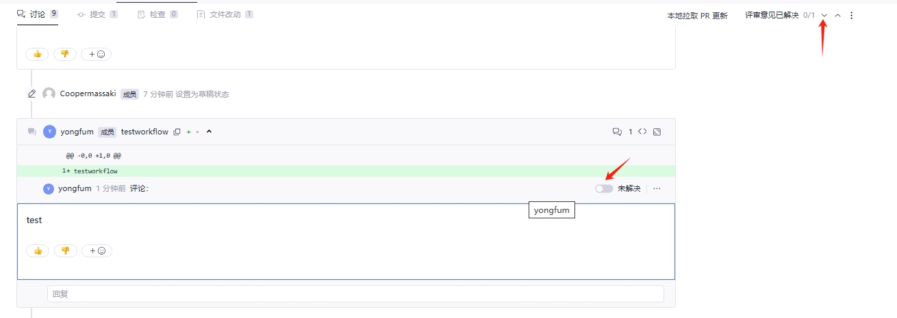

    **规避措施:** PR合入前请开发者确认PR的所有评审意见已经被解决。

7. 评论提示信息是"The following labels are not ready..."

    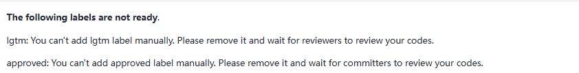

    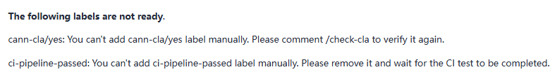
    
    **问题原因:** 非机器人账号添加的标签是无效的
    
    **推荐解决办法如下：**
    先移除不是机器人打上的标签，然后重新评论对应的指令触发机器人打上对应的标签

    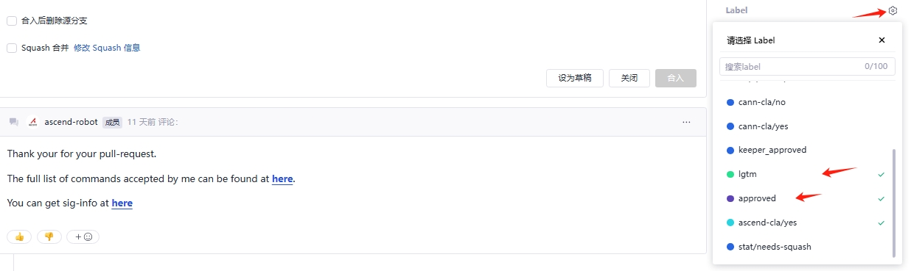

    **规避措施:** 请开发者不要自己添加lgtm、approved、ascend-cla/yes、ci-pipeline-passed等标签