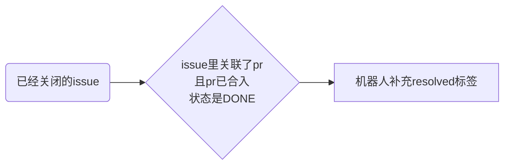
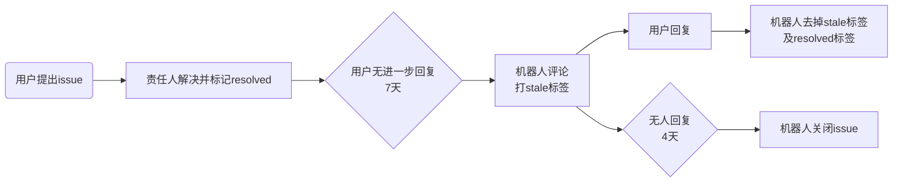
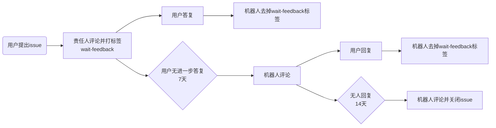
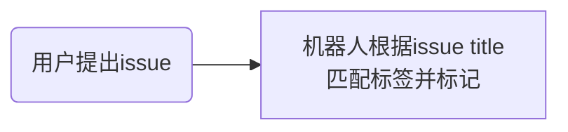

## Robot 能力列表

| 能力分类 | 具体功能 | 详细判定规则与逻辑 | 机器人执行动作 | 关键标签/状态 |
| :--- | :--- | :--- | :--- | :--- |
| **标签自动分类 (Issue)** | 标题前缀打标 | 监测新创建或更新的 Issue，识别标题是否以特定前缀（如 [Bug] , [Feature] ）开头，支持不区分大小写匹配。 | 自动为 Issue 添加对应的分类标签，便于后续按类别筛选。 | bug , feature 等自定义标签 |
| **已解决管理 (Issue)** | 已解决自动识别 | 检查已关闭（Closed）的 Issue，若其关联的所有 Pull Request (PR) 均已合入（Merged），则判定为已解决。 | 自动添加 resolved 标签，并在数据库中记录解决时间。 | resolved |
| **已解决管理 (Issue)** | 闲置状态标记 (Stale) | 针对带有 resolved 标签且处于 Open 状态的 Issue，若提单人超过 7 天未进一步答复。 | 发布提醒评论并添加 stale 标签，告知用户若无异议将自动关闭。 | stale |
| **已解决管理 (Issue)** | 活跃状态恢复 | 针对带有 stale 或 resolved 标签的 Issue，若提单人在此期间重新发布了评论。 | 自动移除 stale 和 resolved 标签，将其恢复为活跃跟进状态。 | 移除 stale , resolved |
| **生命周期维护 (Issue)** | Stale 超期关闭 | 针对已被标记为 stale & resolved 的 Issue，若在 4 天内没有任何用户回复活动。 | 自动关闭（Close）Issue，清理积压的非活跃任务。 | closed |
| **交互闭环管理 (Issue)** | 等待回复预警 | Issue 带有 wait-feedback 标签且处于 Open 状态，负责人已回复但提单人超过 7 天未回复。 | 发布预警评论，提醒用户提供进一步信息，否则将暂时关闭 Issue。 | wait-feedback  |
| **交互闭环管理 (Issue)** | 回复自动消标 | Issue 带有 wait-feedback 标签且处于 Open 状态，监测到提单人（Author）发布了最新回复。 | 自动移除 wait-feedback 标签，提醒负责人用户已反馈。 | 移除 wait-feedback |
| **交互闭环管理 (Issue)** | 超期自动关闭 | 在发送预警评论后，若提单人继续保持沉默超过 14 天。 | 发布结项评论并自动关闭（Close）Issue。 | closed |
| **CLA 签署检查 (PR)** | 强制检查 CLA | 用户评论 `/check-cla` | 重新检查提交者 CLA 状态，根据结果添加 `ascend-cla/yes` 或 `ascend-cla/no` 标签。 | `ascend-cla/yes`, `ascend-cla/no` |
| **CLA 签署检查 (PR)** | 取消 CLA 标签 | 仓库管理员评论 `/cla cancel` | 强制删除 `ascend-cla/yes` 标签。 | 移除 `ascend-cla/yes` |
| **持续集成 (CI) (PR)** | 触发流水线 | 用户评论 `compile` | 触发 CodeArts 编译流水线，成功打 `ci-pipeline-passed`，失败打 `ci-pipeline-failed`。 | `ci-pipeline-passed`, `ci-pipeline-failed` |
| **持续集成 (CI) (PR)** | 前冒烟测试 | 用户评论 `system-test` | 针对 MindIE-SD 仓库触发前冒烟，成功打 `st-success`，失败打 `st-fail`。 | `st-success`, `st-fail` |
| **持续集成 (CI) (PR)** | 获取构建日志 | 用户评论 `get-log` | 针对 PTA 相关仓库获取构建状态，成功打 `ci-pipeline-passed`，失败打 `ci-pipeline-failed` 并提供日志。 | `ci-pipeline-passed`, `ci-pipeline-failed` |
| **持续集成 (CI) (PR)** | 重试流水线 | 用户评论 `retry` | 针对 PTA 相关仓库重试失败的流水线。 | `ci-pipeline-failed` |
| **持续集成 (CI) (PR)** | 停止流水线 | 用户评论 `stop` | 针对 PTA 相关仓库停止已触发的流水线，打 `ci-pipeline-failed` 标签。 | `ci-pipeline-failed` |
| **代码评审与合并 (PR)** | 评审通过/取消 | 用户评论 `/lgtm` 或 `/lgtm cancel` | 为 PR 添加或移除 `lgtm` 标签，代表代码已评审。 | `lgtm` |
| **代码评审与合并 (PR)** | 同意合并/取消 | 用户评论 `/approve` 或 `/approve cancel` | 为 PR 添加或移除 `approved` 标签，代表合入同意。 | `approved` |
| **代码评审与合并 (PR)** | 检查并合并 PR | 用户评论 `/check-pr` | 检查 PR 标签是否满足条件，若满足则执行合并。 | 合并 PR |
| **代码评审与合并 (PR)** | 守护者审核 | 用户评论 `/merge` | 为 PR 添加 `keeper_approved` 标签。 | `keeper_approved` |
| **通用标签管理 (Issue/PR)** | 标签增删 | 用户评论 `/kind`, `/priority`, `/sig` 等指令 | 为 Issue 或 PR 添加/移除对应的分类、优先级或 SIG 标签。 | `kind/**`, `priority/**`, `sig/**` |
| **负责人管理 (Issue)** | 指派/取消负责人 | 用户评论 `/assign` 或 `/unassign` | 为 Issue 指派或取消负责人。 | 指派状态 |

## 机器人Issue自动化处理流程图 (Workflow)

### Rule 1: 已解决自动识别 (触发机制：定时任务)

### Rule 2: 闲置状态管理 - Resolved (触发机制：定时任务)

### Rule 3: 交互闭环管理 - Wait Response (触发机制：定时任务)

### Rule 4: 标题前缀打标 (触发机制：Webhook)

#### Rule 4 详细匹配规则与效果

| 标题前缀 (不区分大小写) | 自动添加标签 | 效果说明 |
| :--- | :--- | :--- |
| `[Bug]` | `bug` | 标记该 Issue 为缺陷或故障，便于后续跟踪修复。 |
| `[Feature]` | `feature` | 标记该 Issue 为新需求或功能增强。 |
| `[RFC]` | `rfc` | 意见征求稿 (Request for Comments)，用于技术方案讨论。 |
| `[Performance]` | `performance` | 标记为性能优化、基准测试相关 Issue。 |
| `[Installation]` | `installation` | 标记为安装、部署、环境配置相关问题。 |
| `[Doc]` | `document` | 标记为文档改进、说明手册编写等相关任务。 |
| `[Usage]` | `usage` | 标记为用户使用咨询、常见问题探讨。 |
| `[Roadmap]` | `roadmap` | 标记为项目路线图、阶段性规划相关 Issue。 |

## 规则新增与维护说明
### 机器人 Issue 自动处理规则
机器人 Issue 自动处理规则（包括标签名称、超时时间、评论内容及标题打标映射）统一在 [bot-issue-manage.yaml](../../config/bot-issue-manage.yaml) 配置文件中进行维护。

- **配置项说明**: 
    - **标签名称配置 (`label_***`)**:
        - `label_resolve`: 标识 Issue 已解决的标签。
        - `label_stale`: 标识 Issue 进入闲置状态的标签。
        - `label_wait_feedback`: 标识正在等待 Issue 提交者反馈的标签。
    - **超时天数配置 (`***_days`)**:
        - `resolve_to_stale_days`: 从 Issue 被打上 `resolved` 标签开始算起，到自动标记为 `stale` 之间允许的最大未更新天数。
        - `stale_to_close_days`: 从 Issue 被打上 `stale` 标签开始算起，到机器人自动执行关闭操作之间允许的最大未更新天数。
        - `wait_feedback_to_warn_days`: 当 Issue 带有 `wait-feedback` 标签且最后一条评论来自负责人时，到机器人发布超时预警评论之间允许的最大未更新天数。
        - `wait_feedback_to_close_days`: 当 Issue 带有 `wait-feedback` 标签且最后一条评论来自负责人时，到机器人自动执行关闭操作之间允许的最大未更新天数。
    - **评论模板配置 (`***_comment`)**:
        - `stale_comment`: 当 Issue 因长期未更新被标记为 `stale` 时，机器人自动发布的提示评论内容。
        - `wait_feedback_warn_comment`: 当等待用户反馈超时（达到预警天数）时，机器人发布的预警评论内容。
        - `wait_feedback_close_comment`: 当等待用户反馈严重超时（达到关闭天数）时，机器人关闭 Issue 时发布的结束评论内容。
    - **自动化映射配置**:
        - `title_prefix_to_label`: 定义 Issue 标题前缀（如 `[Bug]`）与需要自动添加的标签（如 `bug`）之间的映射关系。
- **新增规则步骤**: 
    1. **修改配置**: 在 [bot-issue-manage.yaml](../../config/bot-issue-manage.yaml)中按需新增映射或调整参数。 
    2. **提交 PR**: 将修改后的配置文件提交 PR 到对应代码仓。 
    3. **生效时间**: PR 合入后，机器人配置通常在每轮任务执行前自动刷新生效。 
- **注意事项**: 
    - 确保目标仓库中**已存在**配置的标签，否则机器人可能无法成功执行打标动作。
