# Ascend社区会议指南

## 一、介绍

Ascend社区在官网 [社区会议平台](https://meeting.ascend.osinfra.cn/) 提供会议预定功能。

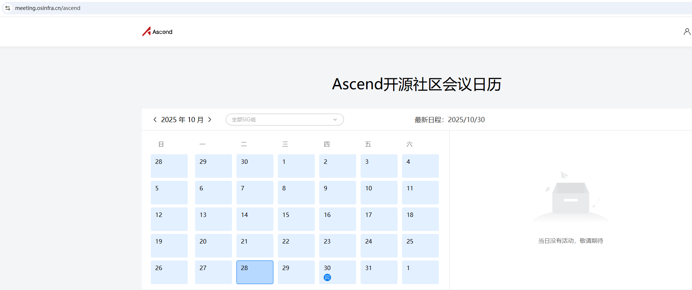

## 二、如何使用

### 1.申请权限

1、申请成为对应SIG组的Committer或Maintainer，您可以通过点击[Ascend 社区协作指南](https://gitcode.com/Ascend/community/blob/master/docs/role-guidance.md)查看社区角色。

2、进入会议平台个人中心，绑定gitcode。

注意：

（1）会议权限同步周期为1个小时，您绑定gitcode后，若您是SIG组Committer或Maintainer，将在**1小时内**为您分配会议预定权限。

（2）有权限时如下图所示：

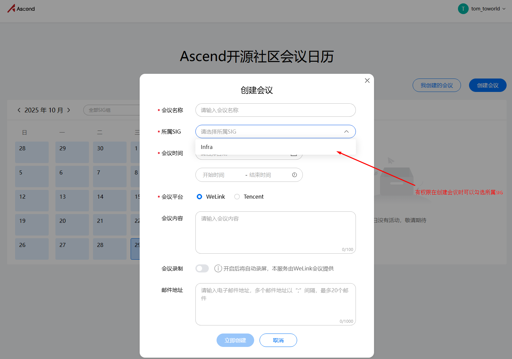

### 2.创建会议

当您拥有会议预定权限后，可创建会议。

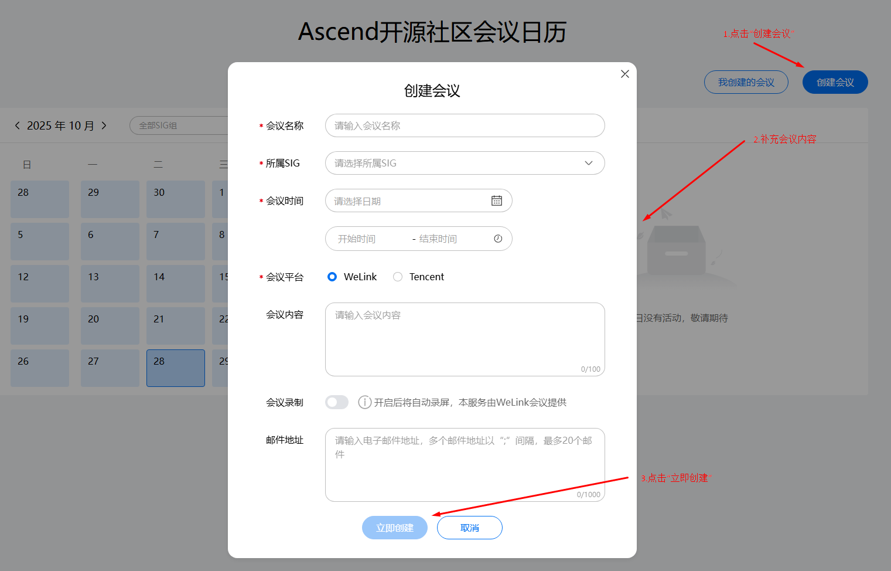

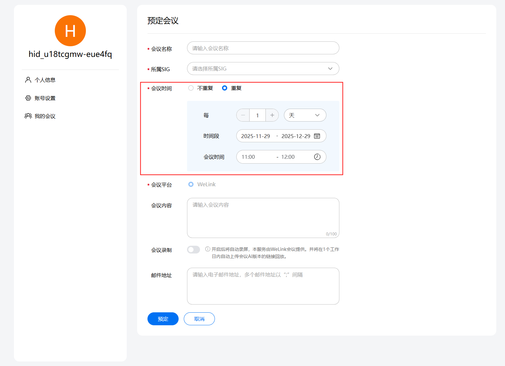

填写会议内容：

+ 会议名称： 这场会议的主题
+ 所属SIG组：选择所需要开会议的SIG组
+ 会议时间：选择对应的会议时间，可以选择单次会议与周期会议
+ 会议平台：社区的会议能力由第三方提供的，目前只支持WeLink会议（蓝版）
  + WeLink会议：详细内容见：https://www.huaweicloud.com/product/welink-download.html
+ 会议内容：请输入会议的议题或者大概内容，详细的议题内容后续可以在etherpad里面填写。
+ 会议录制：开启此选项，会议会自动录制，会议结束后会自动保存在第三方会议平台中；如果后期增加会议回访，会在官网中显示已开启录制的视频。
+ 邮件地址：填写需要通知参加会议的核心人员和邮件列表，以“；”间隔，最多填写20个邮箱地址。发送成功后可以在对应的邮件列表归档中查看此通知邮件，如果没有则存储拦截情况，请联系基础设施@drizzlezyk [zhongyuanke@huawei.com](mailto:zhongyuanke@huawei.com)处理。

创建的会议会在官网上进行公开。

### 3.修改会议

如果你的会议时间需要调整，你可以进行修改会议，请根据下面截图进行操作：

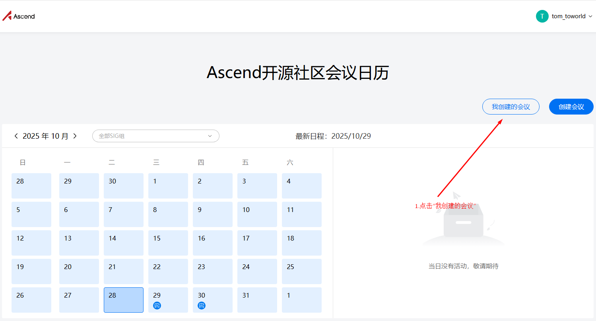

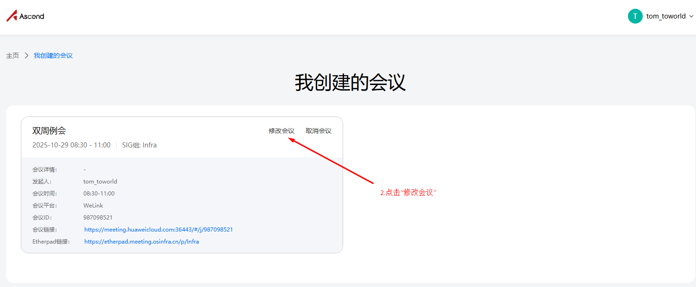

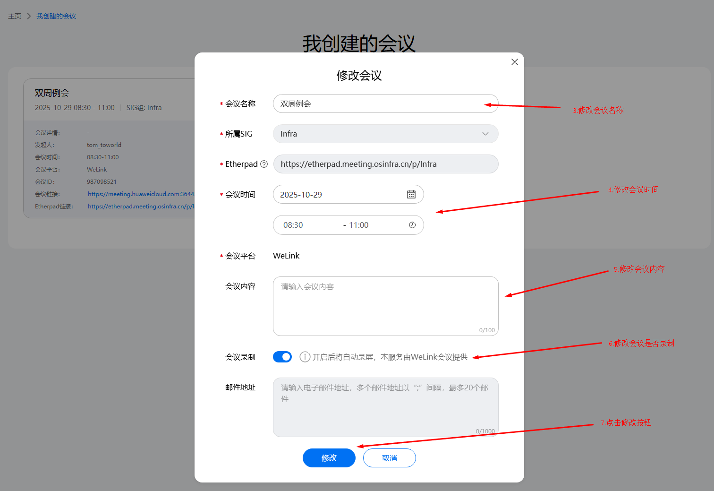

+ 注意：修改会议暂不支持修改邮件地址

### 3.删除会议

如果你的会议时间需要取消，你可以进行取消会议，请根据下面截图进行操作：

+ 限制：在会议过期或者在半个小时之内即将开始的会议，比如昨天的会议会无法删除；比如半个小时之内即将开始的会议无法删除，这是系统默认半个小时为会议准备时间，大家都准备参加会议，此时取消会议，会对用户造成一定的影响。

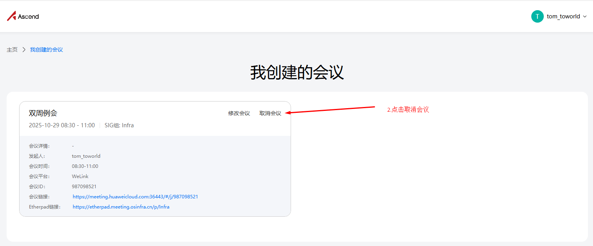

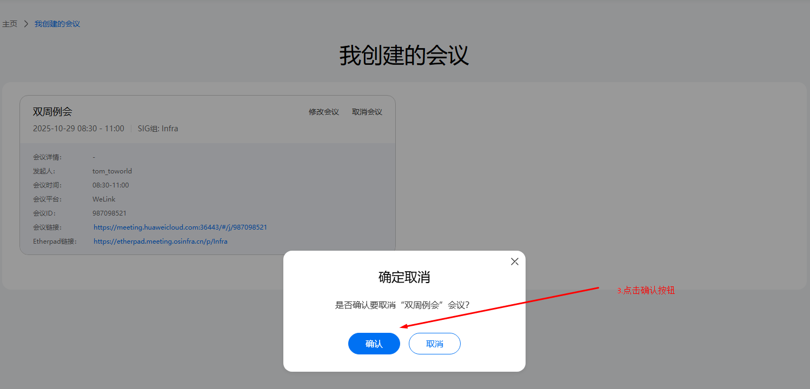

### 4.我如何参加会议？

当会议创建后，并进入会议开始时间，我该通过什么方式参加会议？

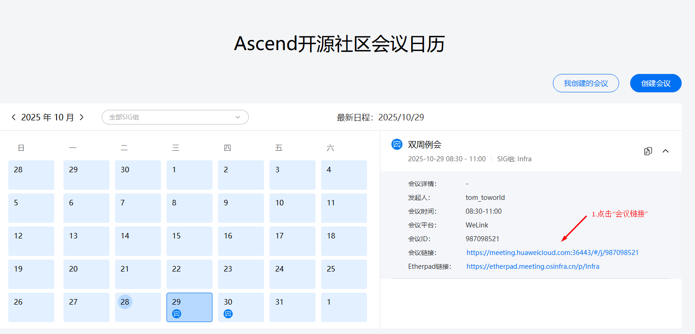

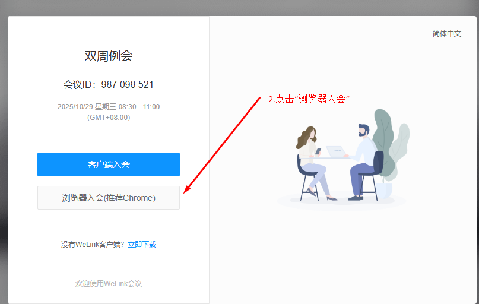

注意：你也可以下载蓝版welink后通过客户端入会，入会的时候输入会议 ID， 比如截图的会议ID: 987098521

进会后请修改你的个人信息，请不要使用工号。

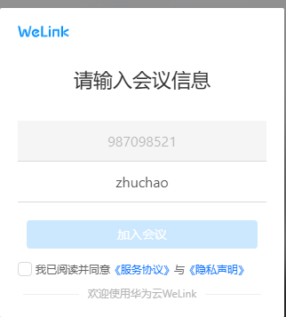

你可以使用在线会议文档记录会议纪要

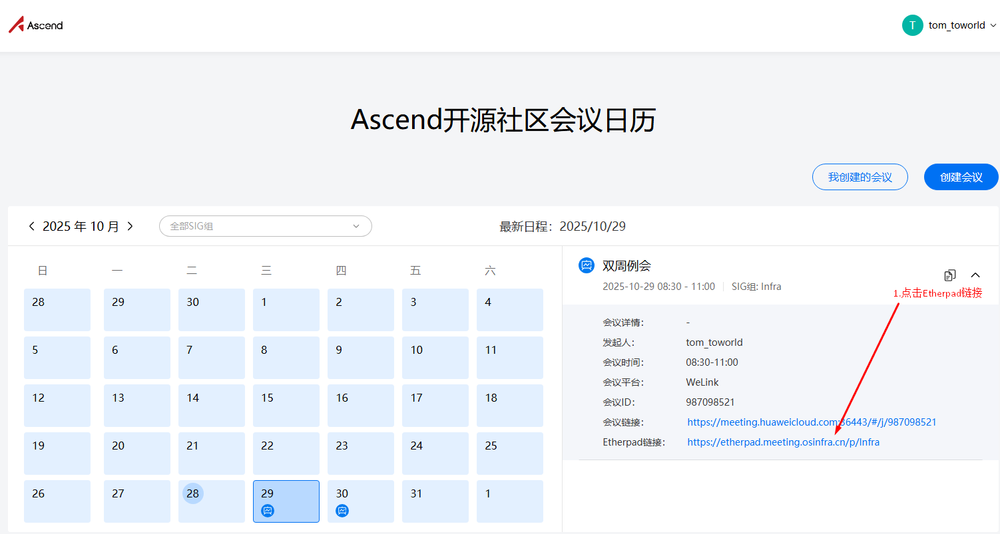

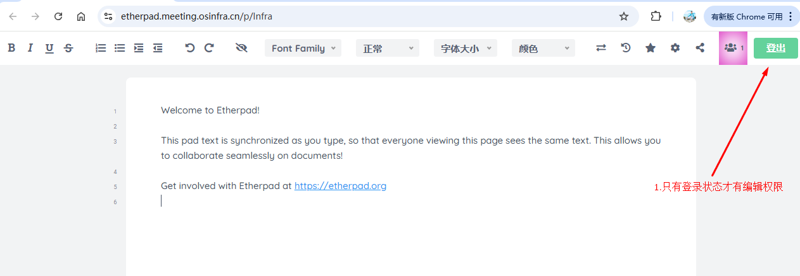

### 5.我如何关闭会议？

当会议所有人员退出后，会议会自动关闭，会议无法主动关闭。

### 6.会议回放

创建会议时，可以勾选会议录制选项，勾选后会录制会议并上传到会议系统中提供观看。

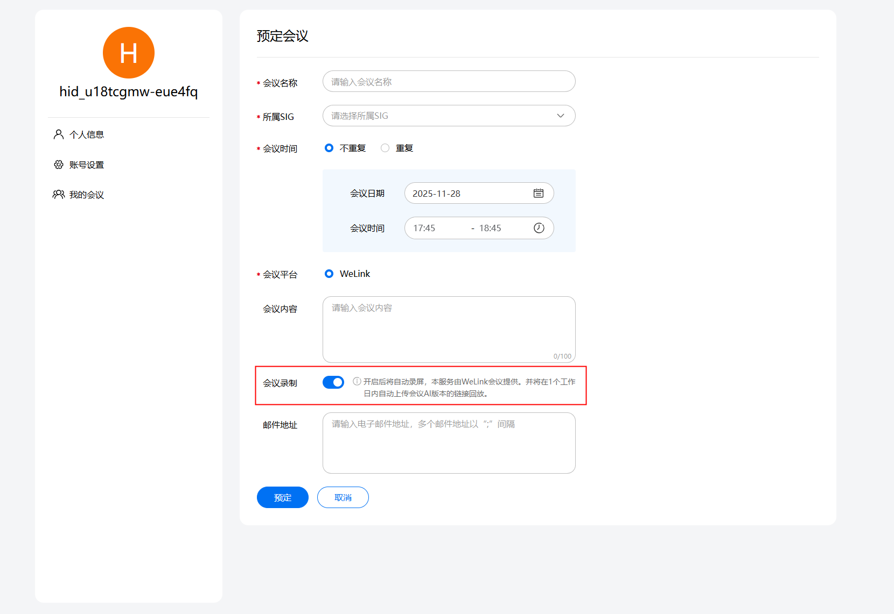

会议回放会在会议结束后一天内上传到会议平台。
会议上传后，可以在会议日历处查找到会议的回放地址。

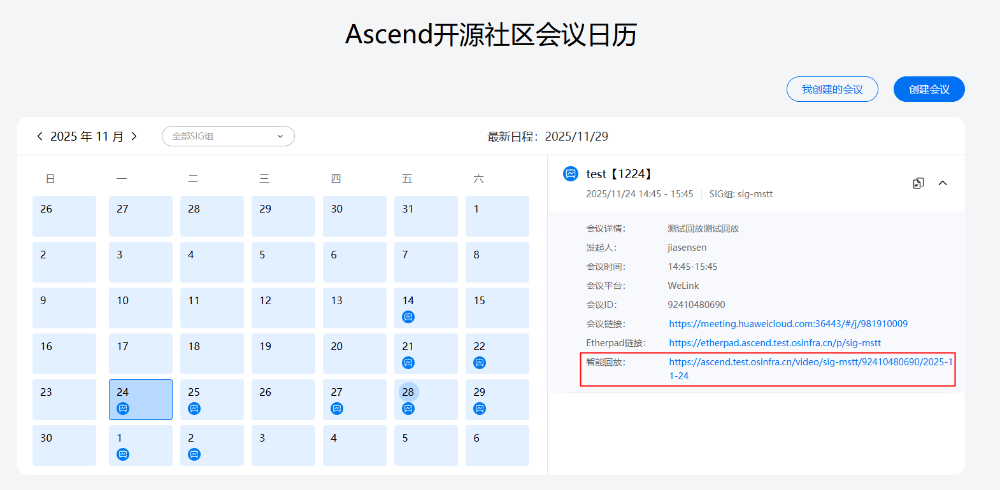

进入回放地址可以查看语音转文字智能会议回放。其中语音转文字需要一定时间完成，完成前也可以先查看会议回放。

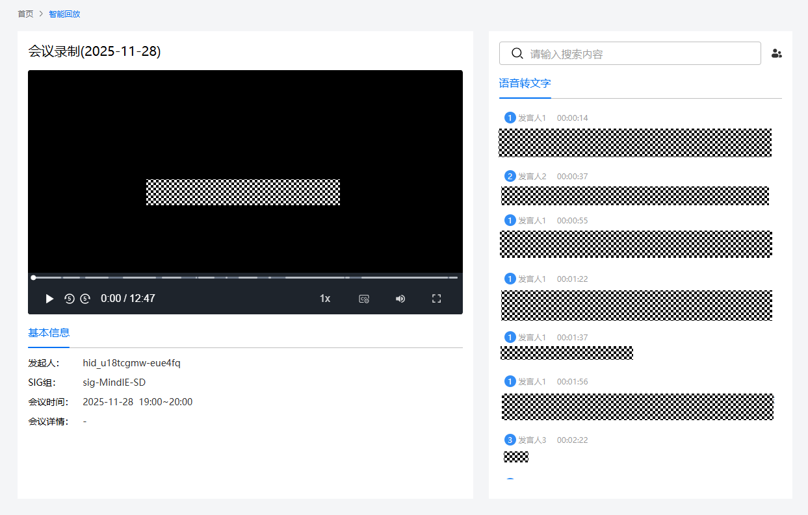

## 三、FAQ

1.创建会议的时候显示“会议时间冲突，请调整会议时间”？

A:  这是因为会议时间已经存在会议，以你创建会议的起始和结束时间的半个小时内无会议来判断，如果您遇到该提示，请尝试更换一个会议时间，如果一直出现该提示，请联系 [@drizzlezyk](https://gitcode.com/drizzlezyk) [zhongyuanke@huawei.com](mailto:zhongyuanke@huawei.com) 处理。

2.WeLink会议出现“云会议室资源正在召开另外一场会议”？

A:  可能是因为上一场的会议没有结束，或有人没有退出导致，请稍等再重试一下，如果长时间出现该提示，请联系 [@drizzlezyk](https://gitcode.com/drizzlezyk) [zhongyuanke@huawei.com](mailto:zhongyuanke@huawei.com) 进行处理。

